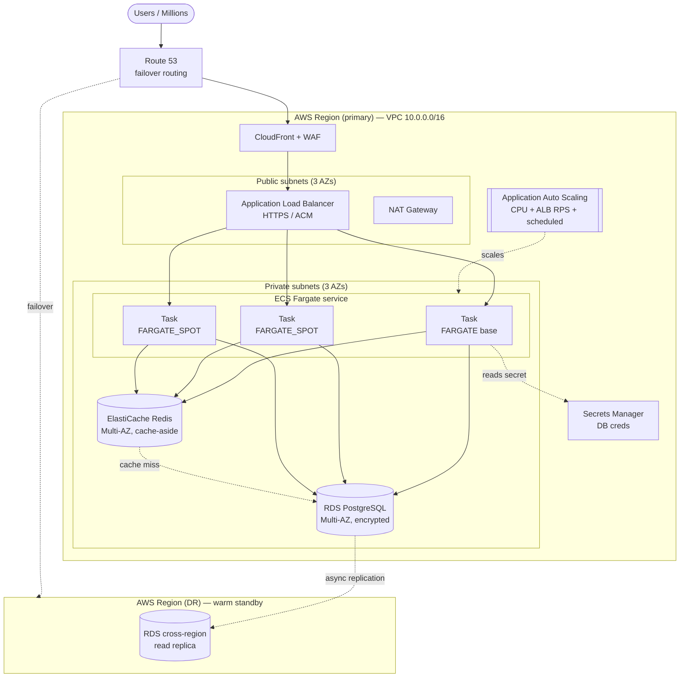
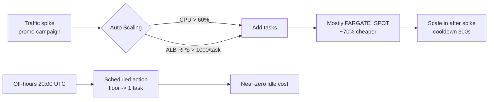

# Architecture Diagram

Rendered Mermaid below (viewable on GitHub / any Mermaid viewer). A Draw.io-
importable file is provided as `architecture.drawio` for the formal deliverable.

## Primary region topology

## Autoscaling & cost flow (campaign vs off-hours)

